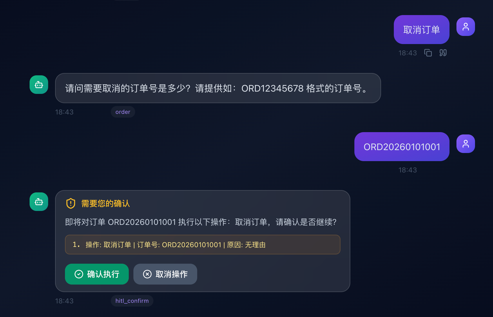

**记录一下开发过程和相关思考**

## 当前工作

问题：图的 checkpoint 状态存在 PostgreSQL 中，永不过期

**解决方案**：针对客服场景：定时任务24h自动清理一次PostgreSQL的checkpoint数据，目标数据：T-1


## 已完成工作（暂未加到README）

1、学习SKILL：
- https://github.com/anthropics/skills
- https://platform.claude.com/docs/en/agents-and-tools/agent-skills/overview
- [如何写出好的SKILL](https://github.com/datawhalechina/hello-agents/blob/main/Extra-Chapter/Extra08-%E5%A6%82%E4%BD%95%E5%86%99%E5%87%BA%E5%A5%BD%E7%9A%84Skill.md)

2、引入SKILL：先在订单操作中引入SKILL，由SKILL指导LLM选择并调用工具+处理调用结果
- 文件目录：/skills/order_skill/*
- 代码分支：feature/skills
- 实现代码：[skill_tool](../tools/skill_tool.py)

- 思考：现在的SKILL靠提示词触发，软约束（不一定执行lookup_skill）

3、由于加载长期记忆（embedding+搜索）比较耗时，且意图识别可以只考虑短期记忆 -> 拆分短期记忆和长期记忆，利用langgraph的并行机制，如下：
```
START ──┬── load_memory(短期记忆) → intent(意图识别) ──┬── intent_post(汇合节点，无业务逻辑处理) → 路由分发
        └── load_long_term_memory(长期记忆) ──────────┘
```
**踩坑记录：**
- 问题：观察日志发现，并行节点后的节点，比如意图汇合节点和反问节点都执行了两次，而且state合并出现问题
- 分析原因：图结构中，两条并行分支到达汇合节点 intent_post 的深度不同：2个节点｜｜1个节点；LangGraph 在深度不一致时，不会把两条入边视为同一个 fan-out group 的汇合，而是每条入边分别触发下游节点。
- 解决方案：将 load_memory + intent 合并为单个图节点（或者在长期记忆分支加一个虚拟节点也行）


4、加入HITL机制，比如：申请退款、取消订单等高危操作，langgraph自带interrupt()+Command，支持中断与恢复

问题一：HITL中断给用户后，用户如果一直不操作怎么办？

- 用户发新消息时会冲突 — 同一个 thread_id 上 ainvoke() 新输入，但图还在 interrupted 状态，可能报错或行为异常
- 无自动取消机制 — 资源白白占用

**解决方案**：利用redis的TTL机制：Redis HITL 状态注册（带 TTL）、新消息前自动取消过期 HITL、hitl_confirm 事件携带超时信息。
边界场景需要处理：Redis key 5 分钟过期后，_auto_reject_stale_hitl 查不到 pending 状态，但 PostgreSQL checkpoint 里的图仍是 interrupted。新的 ainvoke 会打到一个中断态的图上，可能报错。需要在 Robust.run_with_retry 中增加 checkpoint 级别的中断状态检测。
```
用户发消息 ──→ [防线1] API层前置检查 ──→ [防线2] Robust层checkpoint检测 ──→ ainvoke()
                   │                              │
                   ▼                              ▼
           Redis HITL key 存在？            checkpoint 有残留中断？
           → 自动 reject + 恢复图          → 自动 reject + 恢复图
```
具体改动
```
1. service/core/mq.py — HITL 状态管理（Redis 带 TTL）

新增三个函数：
register_hitl_pending() — 中断发生时写入 Redis（默认 5 分钟 TTL）
get_hitl_pending() — 查询是否有未处理的 HITL
clear_hitl_pending() — 确认/拒绝后清除

2. service/app/main.py — API 层前置检查 + 过期校验

新增 _auto_reject_stale_hitl() — 在 /chat 和 /chat/stream 入口处调用，检测到 pending HITL 自动 reject 并恢复图
/chat/confirm 增加过期校验 — Redis key 不存在时返回「操作确认已超时，系统已自动取消」
/chat/confirm 成功后调用 clear_hitl_pending 清除状态

3. service/core/robust.py — Checkpoint 级兜底

新增 _clear_stale_interrupt() — 在 ainvoke 前检查 checkpoint 中是否有残留的 interrupted 状态（覆盖 Redis key 已过期但 checkpoint 仍中断的场景），自动以 rejected 恢复图。

4. service/tasks/chat_task.py — Worker 路径适配 

HITL 中断时调用 register_hitl_pending，hitl_confirm 事件携带超时信息。

超时时间配置：环境变量 HITL_TIMEOUT_SECONDS 控制，默认 300 秒（5 分钟）。
```



## TODO

- 考虑用开源的情感分析库，检测用户情绪，达到情绪安抚的效果
- 细分知识库：设置不同细分场景的知识库；
- 知识库版本管理；知识更新后 -> 语义缓存失效
- 构建完善的评估体系：比如增加用户评分机制，增加用户侧评估，增加更多维度的评估指标
- 安全加强：prompt注入、恶意内容检测（多模态也需考虑）